avaliacao-herbicidas
================
2025-09-10

# Avaliação de potenciais herbicidas

## Introdução

*Problema:* três potenciais bioherbicidas (“A”, “B” e “C”) foram
testados em um bioensaio *in vitro* quanto ao potencial de inibir o
crescimento de uma planta-alvo, em diferentes dosagens.

*Objetivos:* 1) Avaliar qual bioherbicida (“A”, “B” ou “C”) é mais
promissor para ser lançado no mercado com alternativa ao controle de
pragas. 2) Descrever o mecanismo de ação de cada herbicida sobre a
planta-alvo.

## Carregando os dados

``` r
dados<-read.csv2("C:/R/Portfolio/produtos.csv")

str(dados)
```

    ## 'data.frame':    450 obs. of  7 variables:
    ##  $ produto     : chr  "A" "A" "A" "A" ...
    ##  $ dose        : int  0 0 0 0 0 0 0 0 0 0 ...
    ##  $ Comp_raiz   : num  9.12 8.9 9.84 10.82 10.49 ...
    ##  $ N_raizes_lat: int  9 18 13 13 8 7 15 8 8 10 ...
    ##  $ Comp_caule  : num  3.73 4.13 4.73 4.99 5.02 ...
    ##  $ Area_foliar : num  23 30.5 27.9 31 30.7 ...
    ##  $ PSII        : num  0.716 0.751 0.782 0.757 0.71 ...

``` r
head(dados)
```

    ##   produto dose Comp_raiz N_raizes_lat Comp_caule Area_foliar      PSII
    ## 1       A    0  9.120937            9   3.729374    23.02271 0.7162087
    ## 2       A    0  8.895824           18   4.126817    30.50966 0.7505322
    ## 3       A    0  9.837677           13   4.728182    27.92829 0.7822909
    ## 4       A    0 10.820081           13   4.992581    31.00290 0.7566523
    ## 5       A    0 10.492804            8   5.019461    30.67597 0.7102528
    ## 6       A    0  8.590022            7   5.672660    29.30440 0.7628270

O DataFrame está organizado em duas variáveis explicativas.

- *produto*: três categorias (A, B, C)
- *dose*: dose de cada produto em ppm (partes por milhão). Foram
  testadas as seguintes doses: 125, 250, 500, 1000 e 2000 ppm. O
  controle negativo está representado por “0 ppm”.

As seguintes colunas são variáveis resposta, que representam diferentes
medidas da planta-alvo ao final do bioensaio:

- *Comp_raiz*: comprimento da raiz principal

- *N_raizes_lat*: número de raízes laterais que emergem a partir da raiz
  principal

- *Comp_caule*: comprimento do caule, desde o coleto até o ápice
  caulinar

- *Area_foliar*: área total da folha (usando como referência o primeiro
  par de folhas verdadeiras, descartando folhas cotiledonares)

- *PSII*: eficiência quântica efetiva do fotossistema II. Essa medida
  indica a capacidade fotossintética das folhas da planta-alvo.

## Análise exploratória dos dados

### Média e desvio padrão

``` r
#Pacotes necessários
library(tidyverse)
library(ggpubr)
library(moments)
library(ggpmisc)
library(rstatix)
```

Abaixo segue tabela com os dados de média ± desvio padrão para cada
atributo medido, para as plantas-alvo tratadas com os três produtos, nas
diferentes doses.

``` r
Resumo<-dados %>%
  group_by(produto,dose) %>%
  summarise(across(everything(), ~ paste(round(mean(.),2),"±",round(sd(.),2)),
                   .names="{.col}"))
```

    ## `summarise()` has grouped output by 'produto'. You can override using the
    ## `.groups` argument.

``` r
Resumo
```

    ## # A tibble: 18 × 7
    ## # Groups:   produto [3]
    ##    produto  dose Comp_raiz    N_raizes_lat Comp_caule  Area_foliar  PSII       
    ##    <chr>   <int> <chr>        <chr>        <chr>       <chr>        <chr>      
    ##  1 A           0 10.01 ± 0.91 12.04 ± 3.81 4.79 ± 0.85 29.67 ± 2.65 0.74 ± 0.03
    ##  2 A         125 11.41 ± 0.78 12.64 ± 4.68 4.88 ± 0.98 29.79 ± 3.61 0.76 ± 0.06
    ##  3 A         250 9.19 ± 1.57  12.32 ± 4.6  4.4 ± 1.57  30.47 ± 2.37 0.7 ± 0.05 
    ##  4 A         500 5.69 ± 1.13  12.88 ± 4.89 3.16 ± 0.96 29.71 ± 2.81 0.59 ± 0.03
    ##  5 A        1000 3.64 ± 0.85  14.44 ± 4.07 3.66 ± 1.92 29.91 ± 2.37 0.45 ± 0.02
    ##  6 A        2000 2.05 ± 0.89  12.12 ± 4.62 2.37 ± 1.27 29.93 ± 2.41 0.27 ± 0.07
    ##  7 B           0 10.24 ± 1.01 12.92 ± 4.7  5.34 ± 0.95 26.47 ± 3.35 0.75 ± 0.02
    ##  8 B         125 11.42 ± 0.77 12.52 ± 4.49 5.15 ± 0.73 27.4 ± 4.83  0.73 ± 0.02
    ##  9 B         250 9.39 ± 1.29  12.8 ± 4.12  4.54 ± 1.25 27.29 ± 3.2  0.67 ± 0.03
    ## 10 B         500 6.23 ± 0.92  12.32 ± 4.57 3.12 ± 0.88 26.23 ± 4.77 0.54 ± 0.05
    ## 11 B        1000 4 ± 1.04     11.48 ± 4.59 3.36 ± 1.48 26.83 ± 4.5  0.4 ± 0.05 
    ## 12 B        2000 2.07 ± 0.97  14.8 ± 4.23  2.65 ± 1.43 25.88 ± 4.25 0.2 ± 0.05 
    ## 13 C           0 10.4 ± 1.03  11.88 ± 4.28 4.94 ± 0.87 18.97 ± 6.32 0.75 ± 0.02
    ## 14 C         125 11.42 ± 0.78 13 ± 4.13    4.95 ± 0.6  20.28 ± 6.86 0.7 ± 0.02 
    ## 15 C         250 9.59 ± 1.47  13.64 ± 3.76 4.93 ± 1.26 15.94 ± 5.95 0.65 ± 0.06
    ## 16 C         500 5.97 ± 0.97  13.64 ± 4.06 3.35 ± 1.14 22.01 ± 5.16 0.47 ± 0.07
    ## 17 C        1000 4.21 ± 0.92  13.16 ± 4.39 3.74 ± 2.01 19.32 ± 4.72 0.35 ± 0.02
    ## 18 C        2000 2.43 ± 1.18  12.36 ± 4.25 2.71 ± 1.38 20.44 ± 6.13 0.18 ± 0.01

### Avaliando a distribuição dos dados

Antes de realizarmos análises comparativas entre os tratamentos, é
preciso avaliar a normalidade dos dados, por meio do teste de
Shapiro-Wilk, bem como os dados estão distribuídos visualmente, por meio
de histogramas.

``` r
ggplot(data=dados, fill=dose)+
  geom_histogram(aes(x=Comp_raiz))+
  facet_grid(dose~produto)+
  geom_vline(data=Distrib, aes(xintercept=Comp_raiz_media),lty=2)+
  geom_text(data=Distrib, aes(label=paste("Média=",round(Comp_raiz_media,2),"±",round(Comp_raiz_DP),2),x=0,y=9), 
            size=2,hjust=0)+
  geom_text(data=Distrib, aes(label=paste("Curtose=",round(Comp_raiz_KT,3)),x=0,y=8), 
            size=2,hjust=0)+
  geom_text(data=Distrib, aes(label=paste("Skewness=",round(Comp_raiz_SK,3)),x=0,y=7), 
            size=2,hjust=0)+
  geom_text(data=Shapiro, aes(label=paste("Shapiro-Wilk (p = 0.05) =",round(Comp_raiz_Shap,3)),x=0,y=6), 
            size=2,hjust=0)+
  labs(x="Comprimento da raiz (cm)",y="Frequência")+
  theme_bw()
```

    ## `stat_bin()` using `bins = 30`. Pick better value with `binwidth`.

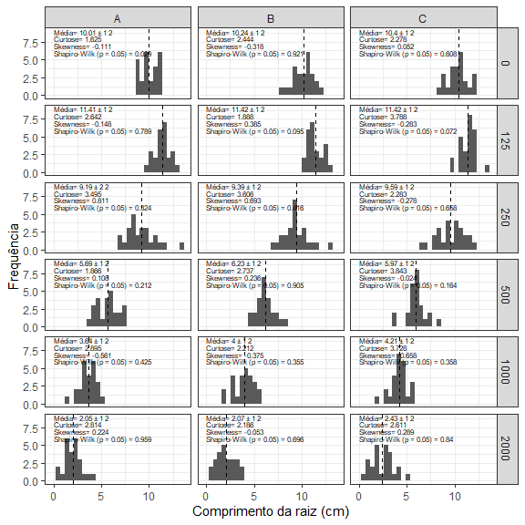<!-- -->

``` r
ggplot(data=dados, fill=dose)+
  geom_histogram(aes(x=N_raizes_lat))+
  facet_grid(dose~produto)+  
  geom_vline(data=Distrib, aes(xintercept=N_raizes_lat_media),lty=2)+
  geom_text(data=Distrib, aes(label=paste("Média=",round(N_raizes_lat_media,2),"±",round(N_raizes_lat_DP),2),x=0,y=9), 
            size=2,hjust=0)+
  geom_text(data=Distrib, aes(label=paste("Curtose=",round(N_raizes_lat_KT,3)),x=0,y=8), 
            size=2,hjust=0)+
  geom_text(data=Distrib, aes(label=paste("Skewness=",round(N_raizes_lat_SK,3)),x=0,y=7), 
            size=2,hjust=0)+
  geom_text(data=Shapiro, aes(label=paste("Shapiro-Wilk (p = 0.05) =",round(N_raizes_lat_Shap,3)),x=0,y=6), 
            size=2,hjust=0)+
  labs(x="Número de raízes laterais",y="Frequência")+
  theme_bw()
```

    ## `stat_bin()` using `bins = 30`. Pick better value with `binwidth`.

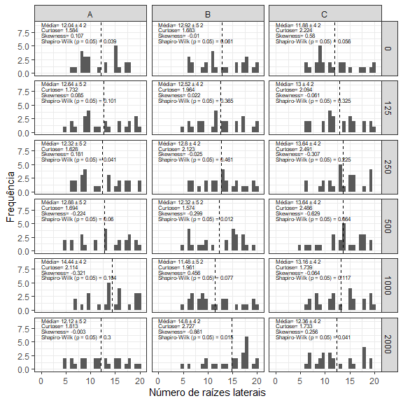<!-- -->

``` r
ggplot(data=dados, fill=dose)+
  geom_histogram(aes(x=Comp_caule))+
  facet_grid(dose~produto)+
  geom_vline(data=Distrib, aes(xintercept=Comp_caule_media),lty=2)+
  geom_text(data=Distrib, aes(label=paste("Média=",round(Comp_caule_media,2),"±",round(Comp_caule_DP),2),x=0,y=9), 
            size=2,hjust=0)+
  geom_text(data=Distrib, aes(label=paste("Curtose=",round(Comp_caule_KT,3)),x=0,y=8), 
            size=2,hjust=0)+
  geom_text(data=Distrib, aes(label=paste("Skewness=",round(Comp_caule_SK,3)),x=0,y=7), 
            size=2,hjust=0)+
  geom_text(data=Shapiro, aes(label=paste("Shapiro-Wilk (p = 0.05) =",round(Comp_caule_Shap,3)),x=0,y=6), 
            size=2,hjust=0)+
  labs(x="Comprimento do caule (cm)",y="Frequência")+
  theme_bw()
```

    ## `stat_bin()` using `bins = 30`. Pick better value with `binwidth`.

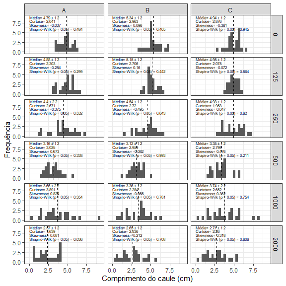<!-- -->

``` r
ggplot(data=dados, fill=dose)+
  geom_histogram(aes(x=Area_foliar))+
  geom_vline(data=Distrib, aes(xintercept=Area_foliar_media),lty=2)+
  geom_text(data=Distrib, aes(label=paste("Média=",round(Area_foliar_media,2),"±",round(Area_foliar_DP),2),x=0,y=9), 
            size=2,hjust=0)+
  geom_text(data=Distrib, aes(label=paste("Curtose=",round(Area_foliar_KT,3)),x=0,y=8), 
            size=2,hjust=0)+
  geom_text(data=Distrib, aes(label=paste("Skewness=",round(Area_foliar_SK,3)),x=0,y=7), 
            size=2,hjust=0)+
  geom_text(data=Shapiro, aes(label=paste("Shapiro-Wilk (p = 0.05) =",round(Area_foliar_Shap,3)),x=0,y=6), 
            size=2,hjust=0)+
  facet_grid(dose~produto)+
  labs(x=expression("Área Foliar"~(mm^2)),y="Frequência")+
  theme_bw()
```

    ## `stat_bin()` using `bins = 30`. Pick better value with `binwidth`.

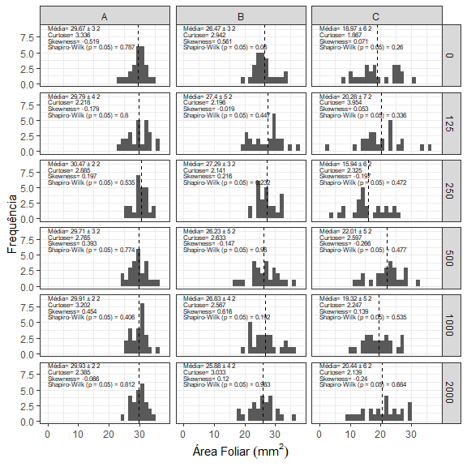<!-- -->

``` r
ggplot(data=dados, fill=dose)+
  geom_histogram(aes(x=PSII))+
  geom_vline(data=Distrib, aes(xintercept=PSII_media),lty=2)+
  geom_text(data=Distrib, aes(label=paste("Média=",round(PSII_media,2),"±",round(PSII_DP),2),x=0,y=25), 
            size=2,hjust=0)+
  geom_text(data=Distrib, aes(label=paste("Curtose=",round(PSII_KT,3)),x=0,y=20), 
            size=2,hjust=0)+
  geom_text(data=Distrib, aes(label=paste("Skewness=",round(PSII_SK,3)),x=0,y=15), 
            size=2,hjust=0)+
  geom_text(data=Shapiro, aes(label=paste("Shapiro-Wilk (p = 0.05) =",round(PSII_Shap,3)),x=0,y=10), 
            size=2,hjust=0)+
  facet_grid(dose~produto)+
  labs(x="PSII",y="Frequência")+
  theme_bw()
```

    ## `stat_bin()` using `bins = 30`. Pick better value with `binwidth`.

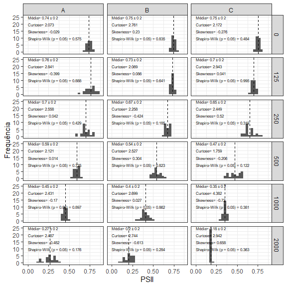<!-- -->

Os testes de Shapiro-Wilk indicam que a maioria das amostras
apresentaram distribuição normal, sem muitos dados discrepantes,
possibilitando análises paramétricas dos dados.

## Comparação dos resultados

Considerando que os fatores analisados são produtos (3) e doses (0, 125,
250, 500, 1000 e 2000 ppm), um simples teste de hipóteses pode mascarar
os diferentes padrões de resultados, enquanto testes como ANOVA fatorial
podem ser mais complicados de serem lidos. E como a dose do produto pode
ser entendida como uma variável contínua, e não discreta, uma análise de
regressão parece mais adequada, e é o que será utilizada.

Abaixo testou-se regressão linear. Os produtos e doses foram comparados
simultaneamente por meio de análise de covariância (ANCOVA).

``` r
modelo<-anova_test(Comp_raiz~dose+as.factor(produto),data=dados)

ggplot(Distrib, aes(x=Distrib$dose, y=Distrib$Comp_raiz_media))+
  geom_point(size=2,aes(shape=Distrib$produto))+
  aes(color=Distrib$produto)+
  geom_errorbar(aes(ymin=Distrib$Comp_raiz_media-Distrib$Comp_raiz_DP , 
                    ymax=Distrib$Comp_raiz_media+Distrib$Comp_raiz_DP ), width=50) +
  geom_smooth(data=Distrib,se=F,method="lm",aes(col=Distrib$produto),lwd=0.5,lty=2)+
  theme_bw(base_size = 12)+
  theme(legend.position = "none")+
  scale_color_manual(values=c("#006400", "red", "blue"))+
  scale_x_continuous(name = "Dose (ppm)",
                     limits=c(0,2100), breaks=c(0,125,250,500,1000,2000))+
  scale_y_continuous(name = "Comprimento da raiz (cm)")+
  stat_poly_eq(formula = y~x, 
               aes(label = paste("italic(\"",c("A","B","C")[after_stat(group)],":  \")*",
                                                "~~~",stat(rr.label),"~~~",stat(p.value.label), sep = "")), 
               parse = TRUE,label.x='left', label.y=c(0.2,0.15,0.1),cex=3)+
  annotate(geom="table",x=1000,y=12.5,label=list(modelo[,c(1,4,5,6)]))
```

    ## Warning: `stat(rr.label)` was deprecated in ggplot2 3.4.0.
    ## ℹ Please use `after_stat(rr.label)` instead.
    ## This warning is displayed once every 8 hours.
    ## Call `lifecycle::last_lifecycle_warnings()` to see where this warning was
    ## generated.

    ## `geom_smooth()` using formula = 'y ~ x'

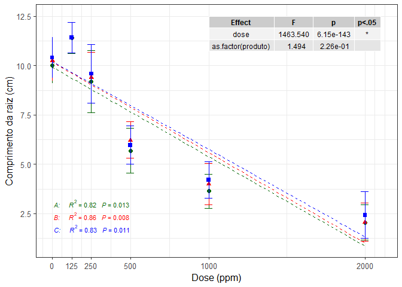<!-- -->

``` r
modelo<-anova_test(N_raizes_lat~dose+as.factor(produto),data=dados)

ggplot(Distrib, aes(x=Distrib$dose, y=Distrib$N_raizes_lat_media))+
  geom_point(size=2,aes(shape=Distrib$produto))+
  aes(color=Distrib$produto)+
  geom_errorbar(aes(ymin=Distrib$N_raizes_lat_media-Distrib$N_raizes_lat_DP , 
                    ymax=Distrib$N_raizes_lat_media+Distrib$N_raizes_lat_DP ), width=50) +
  geom_smooth(data=Distrib,se=F,method="lm",aes(col=Distrib$produto),lwd=0.5,lty=2)+
  theme_bw(base_size = 12)+
  theme(legend.position = "none")+
  scale_color_manual(values=c("#006400", "red", "blue"))+
  scale_x_continuous(name = "Dose (ppm)",
                     limits=c(0,2100), breaks=c(0,125,250,500,1000,2000))+
  scale_y_continuous(name = "Numero de raízes laterais")+
  stat_poly_eq(formula = y~x, 
               aes(label = paste("italic(\"",c("A","B","C")[after_stat(group)],":  \")*",
                                                "~~~",stat(rr.label),"~~~",stat(p.value.label), sep = "")), 
               parse = TRUE,label.x='left', label.y=c(1,0.95,0.9),cex=3)+
  annotate(geom="table",x=1000,y=22,label=list(modelo[,c(1,4,5,6)]))
```

    ## `geom_smooth()` using formula = 'y ~ x'

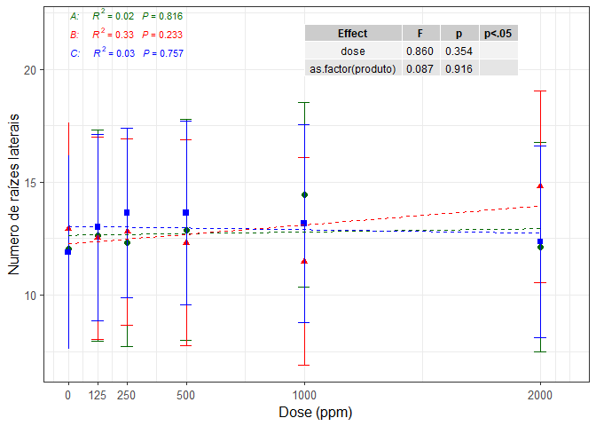<!-- -->

``` r
modelo<-anova_test(Comp_caule~dose+as.factor(produto),data=dados)

ggplot(Distrib, aes(x=Distrib$dose, y=Distrib$Comp_caule_media))+
  geom_point(size=2,aes(shape=Distrib$produto))+
  aes(color=Distrib$produto)+
  geom_errorbar(aes(ymin=Distrib$Comp_caule_media-Distrib$Comp_caule_DP , 
                    ymax=Distrib$Comp_caule_media+Distrib$Comp_caule_DP ), width=50) +
  geom_smooth(data=Distrib,se=F,method="lm",aes(col=Distrib$produto),lwd=0.5,lty=2)+
  theme_bw(base_size = 12)+
  theme(legend.position = "none")+
  scale_color_manual(values=c("#006400", "red", "blue"))+
  scale_x_continuous(name = "Dose (ppm)",
                     limits=c(0,2100), breaks=c(0,125,250,500,1000,2000))+
  scale_y_continuous(name = "Comprimento do caule (cm)")+
  stat_poly_eq(formula = y~x, 
               aes(label = paste("italic(\"",c("A","B","C")[after_stat(group)],":  \")*",
                                                "~~~",stat(rr.label),"~~~",stat(p.value.label), sep = "")), 
               parse = TRUE,label.x='left', label.y=c(0.2,0.15,0.1),cex=3)+
  annotate(geom="table",x=1000,y=8,label=list(modelo[,c(1,4,5,6)]))
```

    ## `geom_smooth()` using formula = 'y ~ x'

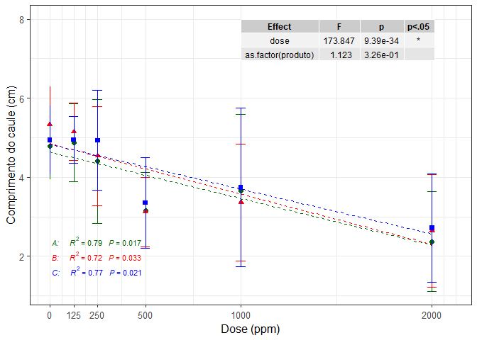<!-- -->

``` r
modelo<-anova_test(Area_foliar~dose+as.factor(produto),data=dados)

ggplot(Distrib, aes(x=Distrib$dose, y=Distrib$Area_foliar_media))+
  geom_point(size=2,aes(shape=Distrib$produto))+
  aes(color=Distrib$produto)+
  geom_errorbar(aes(ymin=Distrib$Area_foliar_media-Distrib$Area_foliar_DP , 
                    ymax=Distrib$Area_foliar_media+Distrib$Area_foliar_DP ), width=50) +
  geom_smooth(data=Distrib,se=F,method="lm",aes(col=Distrib$produto),lwd=0.5,lty=2)+
  theme_bw(base_size = 12)+
  theme(legend.position = "none")+
  scale_color_manual(values=c("#006400", "red", "blue"))+
  scale_x_continuous(name = "Dose (ppm)",
                     limits=c(0,2100), breaks=c(0,125,250,500,1000,2000))+
  scale_y_continuous(name = expression(paste("Área Foliar (",mm^2,")")))+
  stat_poly_eq(formula = y~x, 
               aes(label = paste("italic(\"",c("A","B","C")[after_stat(group)],":  \")*",
                                                "~~~",stat(rr.label),"~~~",stat(p.value.label), sep = "")), 
               parse = TRUE,label.x='left', label.y=c(1,0.95,0.9),cex=3)+
  annotate(geom="table",x=1000,y=40,label=list(modelo[,c(1,4,5,6)]))
```

    ## `geom_smooth()` using formula = 'y ~ x'

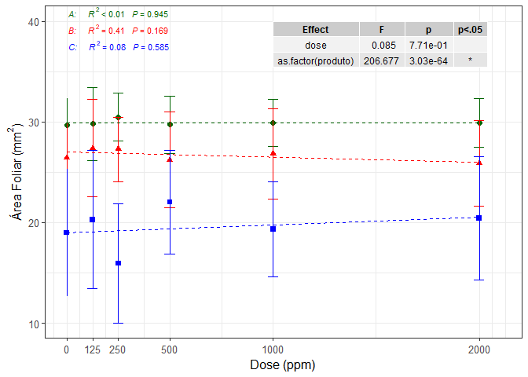<!-- -->

``` r
modelo<-anova_test(PSII~dose+as.factor(produto),data=dados)

ggplot(Distrib, aes(x=Distrib$dose, y=Distrib$PSII_media))+
  geom_point(size=2,aes(shape=Distrib$produto))+
  aes(color=Distrib$produto)+
  geom_errorbar(aes(ymin=Distrib$PSII_media-Distrib$PSII_DP , 
                    ymax=Distrib$PSII_media+Distrib$PSII_DP ), width=50) +
  geom_smooth(data=Distrib,se=F,method="lm",aes(col=Distrib$produto),lwd=0.5,lty=2)+
  theme_bw(base_size = 12)+
  theme(legend.position = "none")+
  scale_color_manual(values=c("#006400", "red", "blue"))+
  scale_x_continuous(name = "Dose (ppm)",
                     limits=c(0,2100), breaks=c(0,125,250,500,1000,2000))+
  scale_y_continuous(name = "PSII")+
  stat_poly_eq(formula = y~x, 
               aes(label = paste("italic(\"",c("A","B","C")[after_stat(group)],":  \")*",
                                                "~~~",stat(rr.label),"~~~",stat(p.value.label), sep = "")), 
               parse = TRUE,label.x='left', label.y=c(0.2,0.15,0.1),cex=3)+
  annotate(geom="table",x=1000,y=0.8,label=list(modelo[,c(1,4,5,6)]))
```

    ## `geom_smooth()` using formula = 'y ~ x'

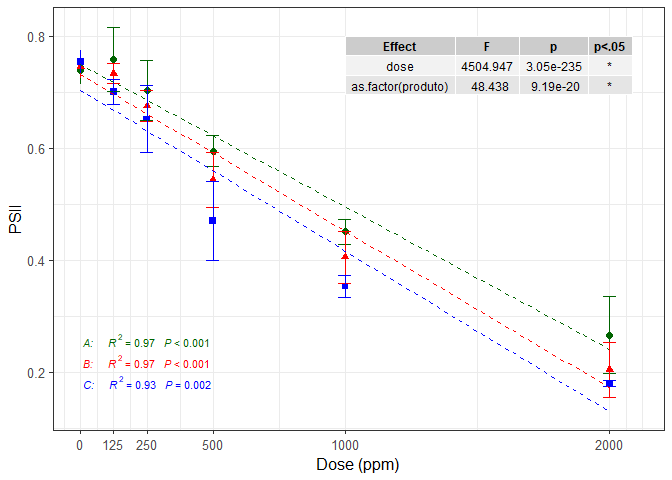<!-- -->

Os resultados acima indicaram que:

- Os produtos A, B e C reduziram o comprimento da raiz e do caule de
  forma dose-dependente. Ou seja, *quanto maior a dose, menos as plantas
  cresceram*. Não houve diferença entre os produtos nesses casos.

- Os produtos *não afetaram* a produção de raízes laterais.

- As principais diferenças entre os produtos foram visíveis na *área
  foliar* e na *eficiência fotossintética (PSII*). Nos dois, o produto C
  exibiu menores valores que B, enquanto A apresentou maiores valores
  (portanto, menos inibição). Quanto à área foliar, a mesma não foi
  significativamente alterada com a dose dos produtos. Ao contrário do
  PSII, onde houve redução da capacidade fotossintética conforme se
  aumentou a dosagem dos produtos.

## PCA - análise de componentes principais

Para melhor compreender como os produtos e as dosagens podem interferir
nos diferentes parâmetros de forma conjunta, análises multivariadas
podem ser úteis. Dessa forma, procedeu-se com a seguinte *análise de
componentes principais (PCA)*.

``` r
library(vegan)
```

    ## Carregando pacotes exigidos: permute

``` r
library(ggfortify)
library(ggrepel)
library(ggbiplot)
```

    ## 
    ## Anexando pacote: 'ggbiplot'

    ## O seguinte objeto é mascarado por 'package:ggfortify':
    ## 
    ##     ggbiplot

``` r
library(factoextra)
```

    ## Welcome! Want to learn more? See two factoextra-related books at https://goo.gl/ve3WBa

``` r
dados_ordenados<-dados%>%arrange(.,
                                factor(produto,levels=c("A","B","C")),
                                dose)
#Rodando a PCA propriamente dita
pca<-prcomp(dados_ordenados[,-c(1,2)], scale.=T)
res.km <- kmeans(scale(dados_ordenados[,-c(1,2)]), 2, nstart = 25)
res.km$cluster
```

    ##   [1] 2 2 2 2 2 2 2 2 2 2 2 2 2 2 2 2 2 2 2 2 2 2 2 2 2 2 2 2 2 2 2 2 2 2 2 2 2
    ##  [38] 2 2 2 2 2 2 2 2 2 2 2 2 2 2 2 2 2 2 2 2 2 1 2 2 2 2 2 2 2 2 2 2 2 2 2 2 2
    ##  [75] 2 1 2 2 1 1 1 1 1 1 2 1 1 1 1 1 1 1 2 1 1 1 1 1 1 1 1 1 1 1 1 2 1 1 1 1 1
    ## [112] 1 1 1 1 1 1 1 1 1 1 1 1 1 1 1 1 1 1 1 1 1 1 1 1 1 1 1 1 1 1 1 1 1 1 1 1 1
    ## [149] 1 1 2 2 2 2 2 2 2 2 2 2 2 2 2 2 2 2 2 2 2 2 2 2 2 2 2 2 2 2 2 2 2 2 2 2 2
    ## [186] 2 2 2 2 2 2 2 2 2 2 2 2 2 2 2 2 2 2 2 2 2 2 2 2 2 2 2 2 2 2 2 2 2 2 2 2 2
    ## [223] 2 2 2 1 1 1 1 1 1 1 1 1 2 1 1 1 1 1 1 1 1 1 1 1 1 1 1 1 1 1 1 1 1 1 1 1 1
    ## [260] 1 1 1 1 1 1 1 1 1 1 1 1 1 1 1 1 1 1 1 1 1 1 1 1 1 1 1 1 1 1 1 1 1 1 1 1 1
    ## [297] 1 1 1 1 2 2 2 2 2 2 2 2 2 2 2 2 2 2 2 2 2 2 2 2 2 2 2 2 2 2 2 2 2 2 2 2 2
    ## [334] 2 2 2 2 2 2 2 2 2 2 2 2 2 2 2 2 2 2 2 2 2 2 2 2 2 2 2 2 2 2 2 2 2 2 2 2 2
    ## [371] 2 2 2 2 2 1 1 1 1 1 1 1 1 1 1 1 1 1 1 1 1 2 1 1 1 1 1 1 1 1 1 1 1 1 1 1 1
    ## [408] 1 1 1 1 1 1 1 1 1 1 1 1 1 1 1 1 1 1 1 1 1 1 1 1 1 1 1 1 1 1 1 1 1 1 1 1 1
    ## [445] 1 1 1 1 1 1

``` r
autoplot(pca, data=dados_ordenados, col="produto",label=F, 
         loadings=T, loadings.color="purple",loadings.label = TRUE, loadings.label.color="purple",
         loadings.label.size = 3, loadings.label.repel=T, loadings.label.hjust=1,
         add.ellipse=T, alpha=.3)+
  geom_point(aes(size=dose,col=produto),alpha=.3)+
  stat_ellipse(aes(group=factor(res.km$cluster)),level = 0.95, col="black",alpha=.5)+
  scale_shape_discrete(guide = guide_legend(label.theme=element_text(face="italic")))+
  scale_color_manual(values=c("#006400", "red", "blue"))+
  geom_hline(yintercept=0)+ geom_vline(xintercept=0)+
  theme_bw()
```

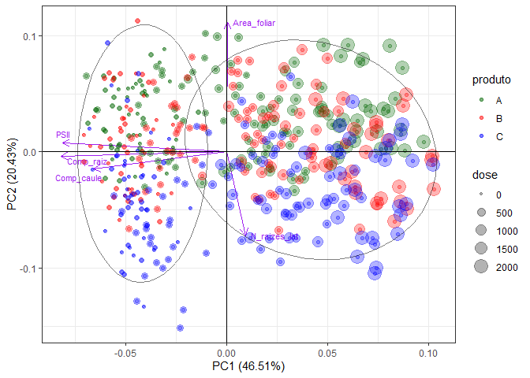<!-- -->

O que a PCA nos indica:

- Os dois componentes PC1 e PC2 explicam aproximadamente 67% da variação
  dos dados, sendo satisfatório para nosso modelo.

- Foi possível observar um claro gradiente de distribuição dos
  indivíduos no eixo do PC1, da esquerda para a direita, da menor
  concentração (0 ppm) para a maior concentração dos produtos (2000
  ppm). Isso determinado pelos comprimentos da raiz e do caule, e pelo
  PSII.

- A área foliar foi o principal determinante na separação entre os
  produtos A, B e C.

## Conclusões

- Os produtos A, B e C podem ser herbicidas viáveis no controle de
  pragas ao inibir o crescimento de plantas-alvo.

- Dentre esses produtos, o produto C é o mais promissor, ao afetar de
  forma mais significativa a capacidade fotossintética, limitando ainda
  mais o estabelecimento de plantas daninhas.
